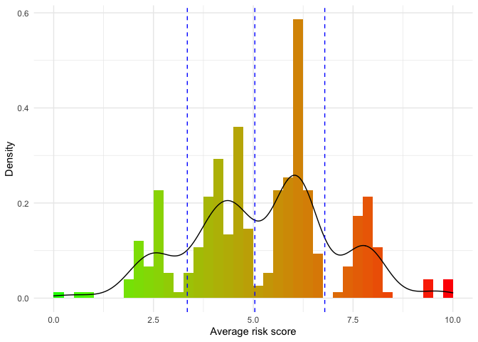
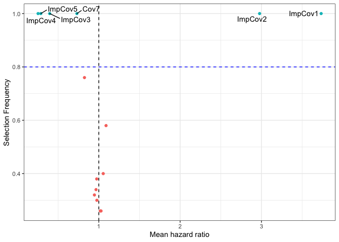
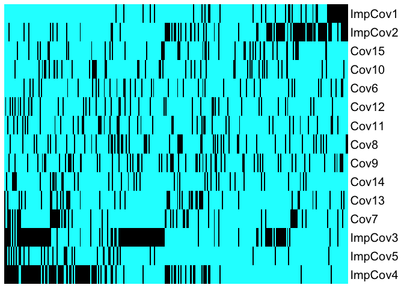
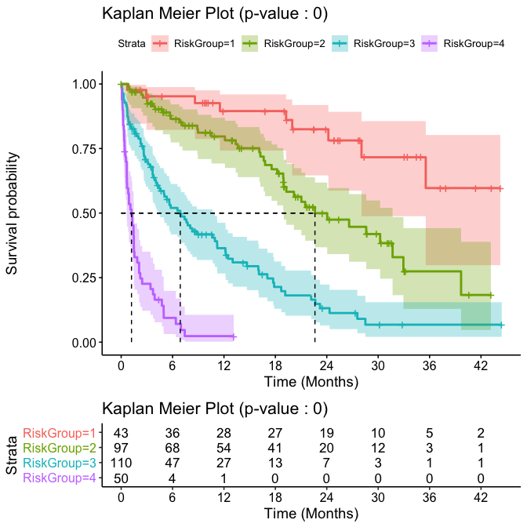

# `OncoCast` R package

<!-- badges: start -->

[](https://travis-ci.org/AxelitoMartin/OncoCast)
[](https://codecov.io/gh/AxelitoMartin/OncoCast?branch=development)
[](https://zenodo.org/badge/latestdoi/211392347)
<!-- badges: end -->

## An Ensemble Learning Approach for Outcome Prediction in Precision Oncology Setting

Ensemble learner framework for survival outcome prediction and
stratification for high dimension data. Originally developed for cancer
genomics with delayed entry in the risk set in mind, and thus can adjust
for left-truncation. OncoCast enables users to easily perform one or
multiple machine learning survival analyses at once and explore and
visualize the resulting output.

## Installing `OncoCast`

`OncoCast` has some dependencies that will be installed if they are not
found in your library. When installing from github a prompt in the
console may ask if you want to install the binaries for curl v4.0
instead of 3.3. There is no need to update it for the package to work
properly.

``` r
install.packages("remotes")
remotes::install_github("AxelitoMartin/OncoCast")
```

If you wish to use the development version of the package please use:

``` r
remotes::install_github("AxelitoMartin/OncoCast", ref = "development")
```

## Using `OncoCast`

We recommend users to walk through the companion website to this package
before their first use of the method. They will be guided through:

  - [**Generating data in a ready for analysis
    format**](https://axelitomartin.github.io/OncoCast/articles/OncoCast-Data.html)
    where the users will be guided on how to format their data to use
    `OncoCast`.
  - [**Performing an ensemble learning
    run**](https://axelitomartin.github.io/OncoCast/articles/Ensemble-Learner.html)
    through a guide of the different machine learning algorithms
    available and how to create an ensemble model.
  - [**Generating comprehensible
    results**](https://axelitomartin.github.io/OncoCast/articles/Risk-Prediction.html)
    with a tutorial on how to explore the predicted risk score of
    patients in the dataset, the prognostic power of the ensemble model,
    the importance of each feature of interest and how to optimize
    creation of risk groups in clinically meaningful subsets.
  - [**Using web-based interactive
    applications**](https://axelitomartin.github.io/OncoCast/articles/Online-Tools.html)
    to simplify the exploration of results and sharing them
    collaborators.

## `OncoCast` Online

There exist a version of OncoCast completely web-based requiring no
coding skills and minimal inputs to create and explore an ensemble
model. It can be found through this [**online RShiny
application**](https://axelitomartin.shinyapps.io/OncoCast/?_ga=2.133036616.733046146.1606492754-1896886074.1572897510).
The user will only be asked to input the dataset they wish to study and
the method they want to use to create the emsemble model.

## Introductory example

Here we show a simple example of OncoCast’s capacities utilizing an
internal dataset. First constructing the ensemble model using for
simplicity the LASSO method:

``` r
onco_run <- OncoCast(data = survData, family = "cox", formula = Surv(time,status)~., method = c("LASSO"),
                     runs = 50, cores = 1, save = FALSE
)
#> [1] "Data check performed, ready for analysis."
#> [1] "LASSO SELECTED"
```

The output of the
[`OncoCast()`](https://axelitomartin.github.io/OncoCast/reference/OncoCast.html)
function can used directly in the
[`getResults_OC()`](https://axelitomartin.github.io/OncoCast/reference/getResults_OC.html)
function to create a set of comprehensible results to be explored.

``` r
results <- getResults_OC(OC_object = onco_run$LASSO, data = survData)
#> Warning: Vectorized input to `element_text()` is not officially supported.
#> Results may be unexpected or may change in future versions of ggplot2.
```

This will generate the average predicted risk score for each patient in
the dataset, while automatically creating risk groups through Kmeans
clustering using a penalty:

``` r
kable(results$RiskScoreSummary)
```

|            | Lower 10% | 1st Quarter | 1st Tertile | Median | 2nd Tertile | 3rd Quarter | Upper 10% |
| :--------- | --------: | ----------: | ----------: | -----: | ----------: | ----------: | --------: |
| Risk Score |      2.64 |        4.04 |        4.39 |   5.58 |        6.08 |        6.25 |      7.75 |

``` r
results$RiskHistogram
```



In order to assess the prognostic performance of the ensemble model we
record the concordance probability index found at each iteration:

``` r
kable(results$CPE)
```

|                                  | Lower 10% | 1st Quarter | Median | 3rd Quarter | Upper 10% |
| :------------------------------- | --------: | ----------: | -----: | ----------: | --------: |
| Concordance probability estimate |      0.73 |        0.74 |   0.75 |        0.77 |      0.78 |

Along with the average predicted risk score of each patients we can use
as a predictor to refit a Cox proportional hazard model:

``` r
kable(results$RiskRefitTable)
```

|           | Coefficient | HazardRatio |       SE |        Z | Pvalue |
| :-------- | ----------: | ----------: | -------: | -------: | -----: |
| RiskScore |   0.6701482 |    1.954527 | 0.055481 | 12.07888 |      0 |

Another metric of interest is the variable importance that we report
using a variety of interactive plots, for the penalized regression
methods such as LASSO (used here) we report this variable importance in
the shape of a volcano plot. We show here a static version of it due to
issue with README files:

``` r
mod_data <- results$resultsAll %>%
  mutate(Feature = rownames(results$resultsAll))

mod_data %>%
  ggplot(aes(x = exp(MeanCoefficient), y = SelectionFrequency, label = Feature)) +
  geom_point(aes(color = .data$SelectionFrequency > 0.8), show.legend = FALSE) +
  geom_text_repel(data = mod_data %>%
              filter(SelectionFrequency > 0.8) ) +
  geom_vline(xintercept = 1, linetype = "dashed") +
  geom_hline(yintercept = 0.8, linetype = "dashed", color = "blue") +
  theme(legend.position = "none") +
  xlab("Mean hazard ratio") + ylab("Selection Frequency") +
  theme_bw()
```



Please refer to the
[**Risk\_Prediction**](https://axelitomartin.github.io/OncoCast/articles/Risk-Prediction.html)
tab on the package’s website to see the interactive version.

We also create heatmaps sorted by predicted risk (left is low risk,
right is high risk) to explore the distribution of features as a
function of risk score:

``` r
results$heatmap.sorted.bin
```



Finally we show the resulting stratification from the cuts performed
above through a Kaplan-Meier plot along with a summary table to ease
interpretation:

``` r
results$KM
```



``` r
kable(results$survivalTable)
```

|             | MedianOS | 95%CI         | 1Ysurvival       | 3Ysurvival       | HazardRatio |
| :---------- | :------- | :------------ | :--------------- | :--------------- | :---------- |
| riskGroup 1 | NA       | (28.05,NA)    | 0.9 (0.74,0.96)  | 0.6 (0.3,0.8)    |             |
| riskGroup 2 | 22.62    | (18.95,31.68) | 0.78 (0.67,0.86) | 0.27 (0.13,0.44) | 2.875       |
| riskGroup 3 | 6.9      | (4.39,10.94)  | 0.35 (0.25,0.45) | 0.07 (0.02,0.15) | 9.351       |
| riskGroup 4 | 1.21     | (0.65,1.49)   | 0.02 (0,0.11)    | 0.02 (0,0.11)    | 41.316      |

We also include tools to perform validation and individual patient
survival predictions, please refer to the
[**Risk\_Prediction**](https://axelitomartin.github.io/OncoCast/articles/Risk-Prediction.html)
tab on the package’s website for more information on those topics.
