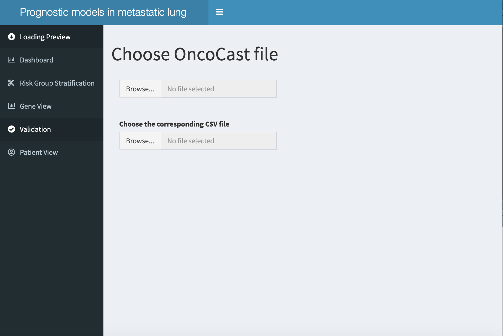
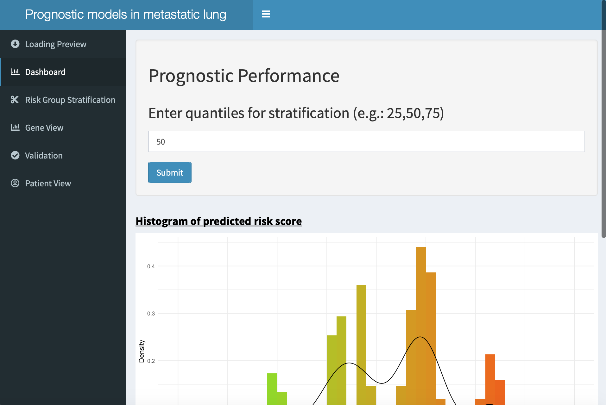
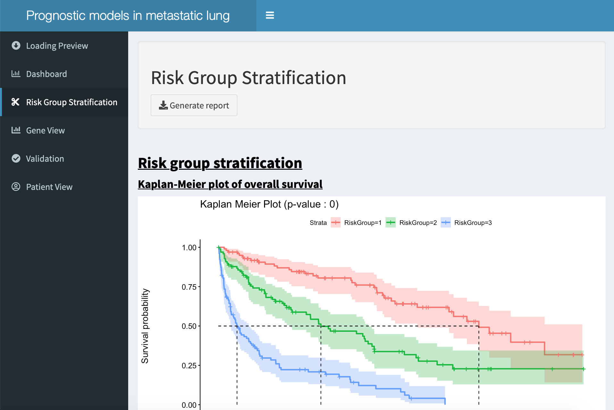
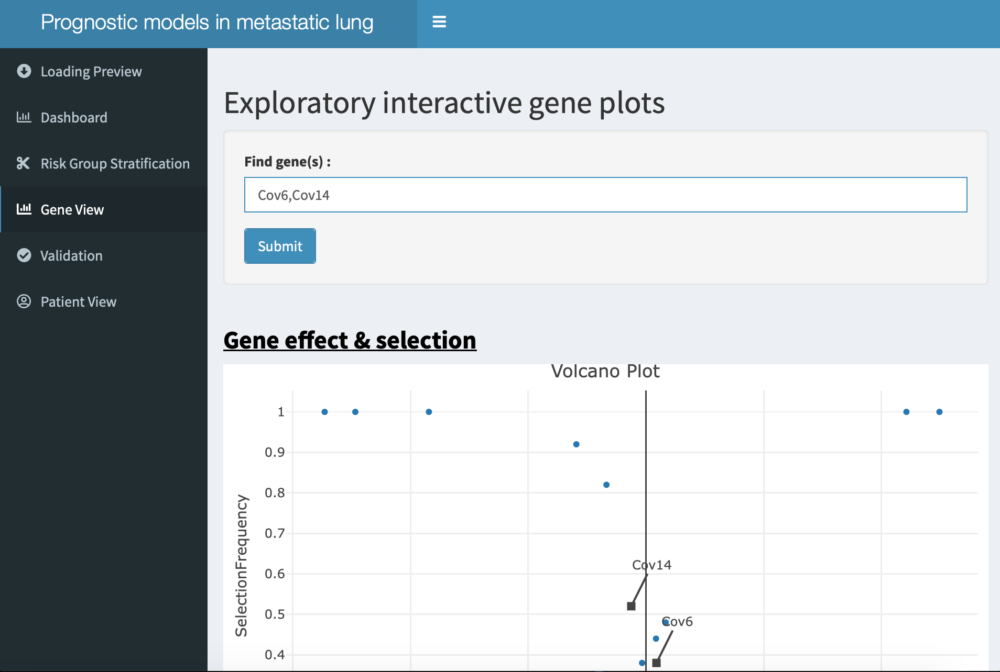

```{r setup, include=FALSE}
knitr::opts_chunk$set(echo = TRUE,fig.width=9,fig.height=6,message=F,warning = F)
load("../data/survData.rda")
library(survival)
library(dplyr)
library(dtplyr)
library(parallel)
# library(OncoCast)
```


# Overview

OncoCast is a computational tool we developed for integrating broad-panel tumor sequencing data with clinical outcome for cancer patient survival prediction. It relies on ensemble learning for outcome predictions using multiple types of data to generate a composite risk score. More specifically OncoCast applies Cox penalized regression methods (LASSO, RIDGE and elastic-net) and generates a cross-validated genomic risk score. This score can be subsequently used to stratify each patient into different risk subsets. The program also generates visualization of feature importance to allow the identification of biomarkers for predicting clinical outcome. A validation module is also included for calculating risk score on validation data sets.

# Simulated Data

Here we use a simulated data set to illustrate the use of OncoCast. A total of n=300 subjects were simulated. Survival time for the subjects were simulated using exponential model with uniform censoring. A total of 15 features were simulated, five of which  associated with outcome and named ‘ImpCov#’. All the other features were named ‘Cov#’. Here is the code used to generate the data:

```{r,eval=FALSE}
## SETUP ###
set.seed(3)
ImpCovMin <- 1
ImpCovMax <- 1.5
n <- 300

x.imp <- cbind(rbinom(n, 1, runif(1,0.1,0.5)),rbinom(n, 1, runif(1,0.1,0.5)),
               rbinom(n, 1, runif(1,0.1,0.5)),rbinom(n, 1, runif(1,0.1,0.5)),
               rbinom(n, 1, runif(1,0.1,0.5)))

coefs <- c(runif(2,ImpCovMin,ImpCovMax),runif(3,-ImpCovMax,-ImpCovMin))
x <- x.imp
mu <- as.vector(coefs %*% t(x))

time <- rexp(n,exp(mu))*12
c <- runif(n,0,as.numeric(quantile(time,0.8)))
status <- ifelse(time < c , 1,0)
time <-pmin(time,c)

numDummy <- 10
DummyCov <- lapply(1:numDummy,function(x){
  rbinom(n, 1, runif(1,0.1,0.2))
})
x.dumb <- do.call(cbind, DummyCov)
x <- as.data.frame(cbind(x,x.dumb))

data <- as.data.frame(cbind(time,status,x))
colnames(data) <- c("time","status",paste0("ImpCov",1:ncol(x.imp)),paste0("Cov",(ncol(x.imp)+1):ncol(x)))
rownames(data) <- paste0("Patient",1:n)
survData <- data

# devtools::use_data(survData, internal = F,overwrite = T)
```

The first dataset contains only a time and censoring variable (named ‘survData’), respectively time and status.

```{r,echo=T}
### dataset 1
dim(survData)
head(survData[,1:7])
```

# Demo

There are two main functions contained in the package: OncoCast and getResults_OC. The OncoCast function performs the esemble learning through penalized regression and cross-validation. getResults_OC summarizes the output and enables exploration of the results in multiple graphical interfaces and summary tables. 

The first step is to install the package and load it in the environment of your working directory.

```{r}
library(OncoCast)
```

The user has  access to the simulated datasets in the package. It is important to note that the method does not currently handle missing data. The user needs to perform imputation on their own before using the software.


```{r}
anyNA(survData)
dim(survData)
```

The above shows there are 300 patients with 15 features in the simulated data set. We recommend users go through the manual using the ??OncoCast command to see the different options. Multithreading is implemented to speed up computation. The user should check the number of cores available using detectCores() before performing any analysis.

```{r,message=F}
library(doParallel)
detectCores()
```

We recommend setting the number of cross-validation to 50 (runs=50) as a minimum. We pipe the results to an R list object called Out.

```{r}
Out <- OncoCast(data=survData,formula = Surv(time,status)~.,
                method = "LASSO",runs = 50,
                save = F,nonPenCol = NULL,cores =1)
```

Once the run completed the user can access the results from the cross validation from each method using the '$' operator.

```{r}
length(Out$LASSO)
str(Out$LASSO[[1]])
```

The Out$LASSO object is a list of length 100 (each index represents a split). Each of these objects themselves contains lists containing (as shown above) the method used, the data, the concordance index for that split, the reffited Cox Proportional hazard model using the penalized regression coefficients value found using the training set, and the predicted risk score for all the patients that fell in the testing set for that split.

These results will be further fed in the getResults_OC function that will let us explore the results in more simplistic and efficient manner. This function takes in as arguments : <br>
- VarSelectObject : Which is a list object outputed by the OncoCast function <br>
- numGroups : a numeric argument that will set the number of risk groups to be made (default is 2 and can go up to 4) <br>
- cuts : a numeric vector of length numGroups - 1, will set the cuts (a vector of quantiles) that will be made in the data based on the predicted averaged risk (default the cut will be made at the median, i.e. cuts=c(0.5)) <br>
- mut.data : a boolean value, in this case of binary mutational data this option will let the user explore the mutations in the different risk groups generated <br>


We will see how to use this function only with the LASSO output generated above.

```{r,message=F}
lasso.results <- getResults_OC(Out$LASSO,data=survData,cuts = c(0.25,0.5,0.75),mut.data = T)
```

## Distribution of risk score

The lasso.results object is a list with multiple plots and tables. We start with the observation of the risk score generated, its refit as a predictor in a Cox proportional hazard model, and the cross-validated concordance index distribution.

```{r,include=F}
library(knitr)
```

```{r}
lasso.results$RiskHistogram
lasso.results$RiskScoreSummary
kable(summary(lasso.results$RiskRefit)$coefficients)
lasso.results$ciSummary
```


The histogram shows the distribution of the composite risk score computed for each patients. This was rescaled from 0 to 10 for ease of interpretation. The median concordance index for the OncoCast score for predicting survival is 0.78. 

## Feature Selection 


In order to explore feature selection two plots are available, the first is a simple bar plot of the selection frequency of the most frequently selected features. The second has more details, it lets the user interactively explore the selection and coefficients of all the features at once. As the user hovers over the points the name of the gene represented by that point along with the average hazard for a mutation on that gene.

```{r,fig.width=9}
lasso.results$inflPlot
lasso.results$selectInflPlot
```


As expected we observe on the bar plot that the features that were simulated to be associated with the outcome have been selected 100% of the time.

The volcano plot shows the frequency at which each feature was selected in the 100 splits we have generated by the mean penalized coefficients found in the cross-validation. Note that the size and color of the points are linked to the mutation frequency of each feature. We observe now that not only do the important covariates have higher selection frequency but also much larger coefficient values. 

## Survival Stratification 

As mentioned above the numGroups argument will enable the user to create between 2 to 4 groups that are made by making specified cuts (using the cuts argument) in the averaged predicted risk score. In this example we made four groups with cuts at 25th, 50th and 75th percentile. For example, the first group corresponds to the patients in the lowest quartile of the predicted risk score (0 <= predicted risk score <= 4.15). We can check how distinct the groups are in survival using a Kaplan-Meier plot as shown below.

```{r,fig.width=9}
lasso.results$KM
```


## Mutational profiles per groups


Furthermore two other tools contained in the output of this function let us explore the distribution of features per group generated. Note that this is only possible with binary data at the moment. The first plot is simple bar plot of the frequency of feature events for the most frequently selected predictors per group.

```{r,fig.width=9}
lasso.results$mut_Plot
```

In order to explore the combinations of genes in each risk group, getResults_OC function returns a second interactive plot. It is a multiple pie chart plot where each pie represents a risk group (in increasing order of risk). As the user hovers over different slices of the pies the name of the mutated genes and gene combinations in that profile along with the number of patients showing that profile and the proportion of patients in that risk group they represent.

To ensure that the number different possible profiles is not too high and ensure that the plot remains readable we limit to the use of the top five most frequently selected genes. The user can also specify the features to be used to generate the pie chart by inputting a character vector containing the exact names of the features into the geneList argument (which is defaulted to be the top 5 most frequently selected genes).


```{r,fig.height=7,fig.width=10}
lasso.results$PieChart
```

As an example, if the user hovers on the pie chart for the high risk group (far right) and on the dark red slice, it shows that 21 patients (or 28%) in the high risk group have the ImpCov2 and ImpCov3 combination.

## Prediction module

The last available function in the package enables the user to input a set of new patient data with the same set of features in the original patient set used for training the risk model and retrieve the predicted genetic risk score for the new subjects. 

```{r}
set.seed(3)
new.data <- as.data.frame(matrix(rbinom(10*100,1,0.5),nrow=100,ncol = 10))
colnames(new.data) <- c("ImpCov1","ImpCov2","ImpCov3","ImpCov4","ImpCov5","Cov6","Cov7",
                        "Cov8","Cov9","Cov10")
rownames(new.data) <- paste0("Incoming",1:100)
Incoming <- predIncomingSurv(Out$LASSO,new.data,surv.print = c(5,10,15),riskRefit = lasso.results$RiskRefit)
```

Here are the different objects outputted by this function, first a data frame of the new patients data with an added column containing the predicted genetic risk score for those patients.

```{r}
head(Incoming$data.out)
```

Second is a histogram showing the distribution of those predicted genetic risk scores.

```{r,fig.width=9}
Incoming$RiskHist
```

An interactive survival plot of individual patients selected using the surv.print function. As the user hovers over the different points extra information will be displayed.

```{r,fig.width=9}
Incoming$IncKM
```

Note that the user can select which predicted survival curves will be displayed in the above graph using the surv.print argument.

## Validation module

If the user has access to an alternative dataset with survival information a validation can be performed. Where the trained model will be applied to the validation data and stratification will be performed based on the choices made previously. Say for example that the data in the section above did have survival information:

```{r}
# add time component
coefs <- c(1.2,1.3,-1.5,-1,-1,rep(0,ncol(new.data)-5))
mu <- as.vector(coefs %*% t(new.data))
n = nrow(row(new.data))
time <- rexp(n,exp(mu))*12
c <- runif(n,0,as.numeric(quantile(time,0.8)))
status <- ifelse(time < c , 1,0)
time <-pmin(time,c)
new.data$time <- time
new.data$status <- status
```

Then the validation can be called in the following manner:

```{r}
validation <- validate(OC_object=Out$LASSO,Results=lasso.results,
in.data=new.data, formula=Surv(time,status)~.)
```

Note the necessity here to have the formula as input. The validation function similarly returns a histogram of the risk distribution:

```{r,fig.width=9}
validation$RiskHistogram.new
```

A data frame of the data used including the predicted risk and the associated risk group:

```{r}
validation$out.data[1:10,c("OncoCastRiskScore","RiskGroup")]
```

And a Kaplan-Meier plot with the cuts chosen initially:

```{r,fig.width=9}
validation$KM
```


## Left-truncated Survival analysis

The OncoCast function also allows the user to perform a left-truncated survival analysis. A simple change in the formula argument will suffice to do this. Taking a simple example with the survData.LT data included in the package, the time and status variables are named time1 (for the late-entry time), time2 (for the survival time) and status (for the censoring). An example of such data can be found in the ‘survData.LT’ set.

```{r}
head(survData.LT[,1:5]) 
```

The user simply needs to use the argument : <u>formula = Surv(time1,time2,status~.)</u>


# Using the app

Embedded in the package is a Shiny R application that can be easily launched and enables the user to quickly go through the results and possibly predict and validate. In order to perform properly the app will request two mandatory inputs and two optional ones.

## Launching the app

In order to launch the app the user will need to input the following line in the console (after loading the OncoCast package):

```{r}
# launchApp()
```

Note that this cannot be run in markdown and thus is commented out. The following will be screenshots of what the app looks like. After the command above is ran a new window will open asking for two files:

- a saved OncoCast run containing a single method (this file will be generated automatically when using the 'save = T' argument in the OncoCast() function).

- the data corresponding to that specific run. Note that if the data does not match the app will crash. The data must be loaded as a comma separated value file with rownames as the first column.

Such files can be found in the 'Test' folder of the package on github <href>https://github.com/AxelitoMartin/OncoCast</href>. Namely here I will be using the OncoCast run 'appTest_LASSO.Rdata' and the data 'appTest_data.csv' (which correspond to the results shown above).

```{r pressure, echo=FALSE, out.width = '100%'}

```

Once the app performs the data checks the other tabs will become functional.


## Viewing the results

The 'Dashboard' tab will cover the prognostics of our model with all the necessary information to make an optimal decision on the cuts to be performed. This tab will show the distribution of the risk score, the concordance index distribution and the refitted Cox's proportional hazard model with the predicted average risk score as a covariate.
Once we have reviewed the results we can enter the cuts we wish to make in the bar at the top. The default is a cut at the median (50). The values entered correspond to the quantiles of the cuts and show be separated by a comma (e.g.: 33,66).

```{r, echo=FALSE, out.width = '100%'}

```

Once submitted (using the submit button), the following tab <b>Risk Group Stratification</b> (containing the stratification results with a Kaplan-Meier and a summary table) will be updated.

```{r, echo=FALSE, out.width = '100%'}

```


The <b>Gene View</b> enables the user to see the selection frequency of each feature and their mean coefficients. The top bar takes names of features as input, these are simply separated by a comma as shown below. They will be printed on the volcano plot to ease the search for specific features.

```{r, echo=FALSE, out.width = '100%'}

```


Finally the <b>Validation</b> and <b>Patient View</b> tab let's the user input a new data set with a similar set of features as shown in the sections above about prediction and validation. These tabs will return the output from those sections.


