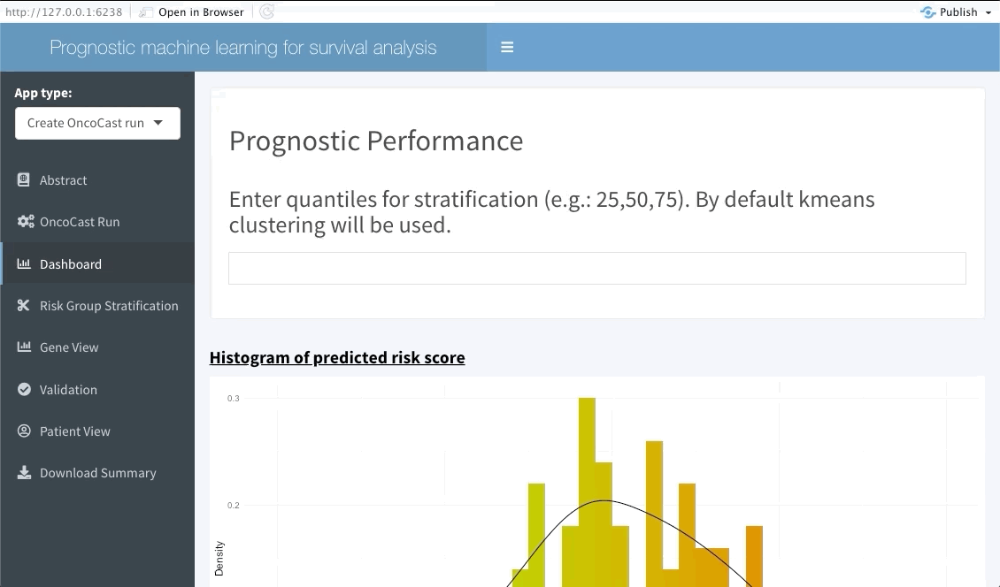
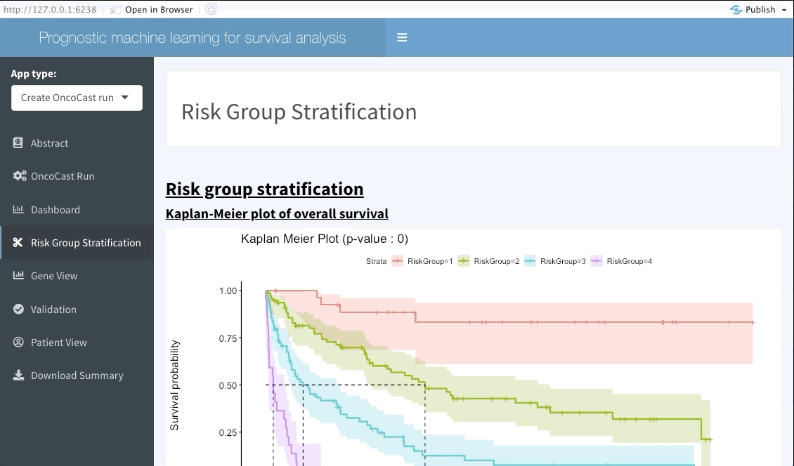
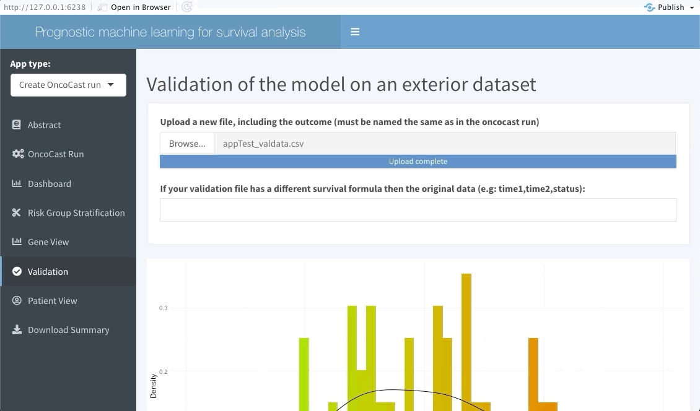

```{r, include = FALSE}
knitr::opts_chunk$set(
  collapse = TRUE,
  comment = "#>",
  message = FALSE,
  warning = FALSE
)
```

```{r setup}
library(OncoCast)
```

# `OncoCast` R shiny applications

In order to make exploration of the results accessible to all, particularly people with little or no R training, we include interactive shiny apps in the package and online. These applications enable the user to either make a run of `OncoCast` or explore the results of a run that as already been performed and saved. This requires only the output of that run and the data used to perform it. Alternatively only the data to be used if the user selects to perform the run through the app.

We will show how to access this applications through the package for both possible functionalities.

## Running `OncoCast` through the internal RShiny application

We include the `launchApp()` function in OncoCast to let users launch the app.

```{r, eval=F}
launchApp()
```

This will open a new window which summarises the way the app works, the goals of `OncoCast` and example data. By default the `AppType` field will select `Create OncoCast run` in the `Abstract` tab. Selecting the `OncoCast Run` tab will lead the user to a new page where they will be asked to input the data to be used for the run, along with the method and number of cross-validation to be used as shown below.


Note that `OncoCast` may need some time to run, particularly if you are using a dataset with a large number of observations. When the run is the done the following tab (`Dashboard`) will update.

## Exploring the results

Regardless of if the user ran `OncoCast` on the RShiny application or chose to input a pre-processed run the exploration tabs will behave in the same fashion.

### Dashboard

The next tab (named Dashboard) summarises the distribution of the average predicted risk score of all patients used to perform `OncoCast`. It also summarises the concordance probability estimate distribution across all runs and refits a Cox's proportional hazard model with the average predicted risk score as predictor. 
The user is free to choose which quantiles to use to perform cuts in the data in order to create risk groups. Note that these should be inputted in the bar at the top of the screen using integers between 1 and 99 (example: 33,66). By default Kmeans clustering will be used.



### Risk group stratification

In the next tab we will be summarising the risk groups created in the dashboard tab above. Note that inputting custom cuts in that tab will be reflected here. We show a Kaplan-Meier plot of the resulting risk groups and a summary survival table for each of the groups below the graph.



### Gene View

This interactive tabs enables the user to explore specific features of interests. The first plot will summarise the variable importance of all features included in the `OncoCast` run. Following are heatmaps for binary and continuous features separetely, that are sorted by predicted risk (low to high risk from left to right). 
Inputting features' names in the top bar will lead to them showing on the summary plot and adding them or ranking them at the top of the heatmaps below.


### Validation

The following tab focuses on validating the results found in the `OncoCast` run performed by applying it to an external dataset with the same features and corresponding time-to-event data. Simply input the new data as a 'csv' file. Note that missing features may lead to spurious results, we thus strongly recommend the user to ensure that all variables used in the `OncoCast` run are also present in the validation dataset. Moreover note that the features' names must be an exact match to be used in the validation.



### Patient view

Similarly to the validation tab the user can also input data from a few patients that are of particular interest and explore their predicted survival curve. We achieve this by creating an interactive plot of predicted survival curve for each of the patients inputted with their probability of survival at each 6 months. 


### Download summary

Finally we let the user download both the results of the exploratory analysis and the `OncoCast` run in the final tab. Currently the results can only be downloaded as a HTML file to incorporate the interactive piece of this application. 


# `OncoCast` online

This application is also available online with no requirements to have R or Rstudio installed on the user's local machine. The fully online version application can be found [**here**](https://axelitomartin.shinyapps.io/OncoCast/?_ga=2.124850764.733046146.1606492754-1896886074.1572897510). Note however that if the data of interest is relatively large we recommend performing `OncoCast` using the R console or even a cluster. Rshiny web applications do not allow for parallel processing which greatly increases the computing time. 


